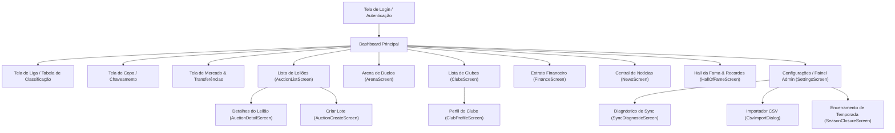

# Especificação Técnica e Regras de Negócio — Legacy Master Liga

Este documento apresenta a especificação técnica completa, regras de negócio e estrutura de dados do aplicativo **Legacy Master Liga**, servindo como guia de referência para recriar o sistema em ambiente Web ou Mobile.

---

## 1. Banco de Dados (Room Local & Firestore Sync)

O sistema utiliza arquitetura de **fonte de verdade local no Room (SQLite)** com **espelhamento assíncrono e reativo no Firebase Firestore** para ligas online.

### Tabelas / Coleções e Relacionamentos

| Tabela (Room) | Coleção (Firestore) | Descrição / Papel no Sistema |
| :--- | :--- | :--- |
| `users` | `users` | Cadastro de usuários locais e autenticados via Firebase Auth. |
| `leagues` | `leagues` | Ligas gerenciadas no sistema (locais ou online). |
| `clubs` | `clubs` (subcoleção da liga) | Clubes participantes de uma liga (incluindo o clube especial `Banco da Liga`). |
| `players` | `players` (subcoleção) | Atletas pertencentes aos clubes ou livres no Banco da Liga. |
| `competitions` | `competitions` | Campeonatos da liga (Pontos Corridos, Mata-Mata, Grupos). |
| `seasons` | `seasons` | Edições/Temporadas de uma competição. |
| `rounds` | `rounds` | Rodadas de uma temporada. |
| `matches` | `matches` | Partidas individuais agendadas ou finalizadas. |
| `goal_events` | `goal_events` | Eventos de gol por partida e jogador (artilharia). |
| `standings` | `standings` | Tabela de classificação calculada por temporada. |
| `transfers` | `transfers` | Histórico de transferências e trocas de atletas. |
| `financial_transactions` | `financial_transactions` | Extrato e lançamentos financeiros em moeda virtual (CR). |
| `auction_lots` | `auction_lots` | Lotes de leilão de jogadores. |
| `auction_items` | `auction_items` | Jogadores em leilão dentro de um lote. |
| `auction_bids` | `auction_bids` | Lances dados pelos presidentes nos itens de leilão. |
| `news` | `news` | Notícias e manchetes geradas deterministicamente pelo motor do app. |
| `arena_duels` | `arena_duels` | Desafios e duelos rápidos entre clubes. |
| `season_closures` | `season_closures` | Encerramentos de temporada com campeões e prêmios. |
| `prize_history` | `prize_history` | Registro histórico de premiações pagas aos clubes. |
| `competition_prizes` | `competition_prizes` | Configuração do fundo de premiação por competição. |
| `online_sync_records` | N/A (local) | Mapeamento de revisões e IDs entre Room local e Firestore. |
| `online_sync_queue` | N/A (local) | Fila de operações de escrita pendentes para envio à nuvem. |

---

## 2. Liga e Geradores de Rodadas

### Criação da Liga
- **Campos:** `id` (Long), `name` (String única), `currencyCode` (padrão: `"CR"`), `status` (`ACTIVE`, `ARCHIVED`), `cloudLeagueId` (String opcional), `isOnline` (Boolean), `createdAt`, `updatedAt`.
- **Bootstrap Padrão (`InitializeDefaultDataUseCase`):**
  - Ao criar a primeira liga (`"Liga M L Amigos"`), o sistema garante a existência do usuário `admin` e do clube neutro `"Banco da Liga"` (`isBank = true`).

### Gerador de Tabela e Rodadas (`ScheduleGenerator.kt`)
- **Formatos Suportados (`CompetitionFormat`):**
  - `SINGLE_ROUND`: Turno único (todos contra todos uma vez).
  - `HOME_AND_AWAY`: Turno e Returno (ida e volta).
  - `KNOCKOUT` / `SINGLE_MATCH`: Mata-Mata (Copa em 1 ou 2 jogos por fase).
  - `GROUPS_AND_KNOCKOUT`: Fase de grupos seguida de mata-mata.
- **Algoritmo de Rotacionamento (Round-Robin / Tabela de Berger):**
  - Inverte o mando de campo em pares alternados para balancear jogos em casa e fora.
  - Se o número de clubes for ímpar, adiciona um participante nulo e gera folga por rodada.

### Tabela de Classificação (`StandingDao.kt` / `StandingEntity`)
- **Pontuação:** Vitória = 3 pontos, Empate = 1 ponto, Derrota = 0 pontos (configurável em `pointsForWin`, `pointsForDraw`, `pointsForLoss`).
- **Critérios de Desempate (em ordem estrita):**
  1. Maior número de **Pontos** (`points DESC`)
  2. Maior número de **Vitórias** (`wins DESC`)
  3. Maior **Saldo de Gols** (`goalDifference DESC` = `goalsFor - goalsAgainst`)
  4. Maior número de **Gols Pró/Feitos** (`goalsFor DESC`)
  5. Ordem Alfabética do Nome do Clube (`clubs.name ASC`)

---

## 3. Lançamento de Partidas e Eventos

### Estrutura de Partida (`MatchEntity`)
- Campos de placar: `homeScore` (Int?), `awayScore` (Int?), `status` (`SCHEDULED`, `COMPLETED`).
- Campos disciplinares: `homeYellowCards`, `homeRedCards`, `awayYellowCards`, `awayRedCards`.
- Penaltis e desempates: `penaltiesHome`, `penaltiesAway`, `winnerClubId`, `advanceReason`.

### Eventos de Gol (`GoalEventEntity`)
- Registra cada gol individualmente: `matchId`, `playerId`, `scoringClubId` (clube beneficiado), `isOwnGoal` (Boolean).
- **Artilharia (`StatisticsDao`):** Calculada somando os gols de cada jogador (`isOwnGoal = 0`) agrupados por atleta em todas as partidas finalizadas da competição.

---

## 4. Módulo de Leilão

### Regras do Leilão (`RoomAuctionRepository.kt` & Firestore)
- **Preço Inicial Padrão:** `startingPriceCr = 5` CR por jogador.
- **Incremento Mínimo:** **5 CR** por lance (`minRequired = currentBid + 5`).
- **Prazos:** `startAt` (início), `endAt` (término), `status` (`SCHEDULED`, `OPEN`, `CLOSED`).
- **Mecanismo de Lance e Trava Financeira (`placeBid`):**
  - Valida se o horário atual está na janela `startAt..endAt` e se o lote/item está `OPEN`.
  - Verifica se o clube tem saldo disponível descontando lances já travados em outros itens ativos (`balance - totalCommittedByClub >= amountCr`).
  - **Devolução de Lance Anterior (`OUTBID`):** Se outro clube era o líder, o lance anterior vai para `OUTBID` e o valor em CR é estornado imediatamente para a conta do clube superado.
  - **Débito do Novo Lance:** O valor do novo lance é debitado imediatamente do clube ofertante (`amountCr` negativo no financeiro).
  - **Atenciosidade Online (Race Condition):** Em ligas online, executa `firestore.runTransaction` no documento do item no Firestore. Se o lance for ultrapassado por outro participante no mesmo milissegundo, reverte o lance com o erro `"Lance ultrapassado por outro participante. Atualize a tela."`.
- **Encerramento (`closeExpiredLots`):**
  - Lotes expirados (`endAt <= now`) são alterados para `CLOSED`.
  - Jogadores arrematados vão para status `SOLD`, o lance vencedor para `WON`, o atleta tem seu `clubId` atualizado para o clube vencedor e é registrada uma transferência no histórico do tipo `"AUCTION"`.

---

## 5. Mercado e Transferências

### Modalidades de Negociação (`MarketScreen` / `TransferEntity`)
1. **Compra/Venda Direta (`TRANSFER`):** Negociação entre 2 clubes por valor negociado em CR.
2. **Dispensa / Rescisão (`RELEASE`):** Clube envia o jogador para o Banco da Liga (`destinationClubId = bank.id`).
3. **Agente Livre (`FREE_AGENT`):** Clube contrata jogador diretamente do Banco da Liga (`originClubId = bank.id`).
4. **Troca de Jogadores (`SWAP`):** Troca dupla enfileirada agrupada por um `swapId` comum.

### Registro Financeiro Espelhado
- Toda transferência válida gera 2 lançamentos financeiros atômicos em `financial_transactions`:
  - Débito no clube comprador (`-valueCr`).
  - Crédito no clube vendedor (`+valueCr`).
  - Atualização do valor disponível e bloqueio contra saldos negativos em compradores.

---

## 6. Estrutura de Clubes e Presidência

### Abas do Perfil do Clube (`ClubProfileScreen`)
1. **Resumo:** Saldo em CR, nome do presidente, estatísticas gerais e distintivo.
2. **Elenco:** Lista completa de atletas do clube, posições e overalls.
3. **Histórico:** Desempenho do clube nas temporadas e edições anteriores.
4. **Negociações:** Histórico de compras, vendas e dispensas.
5. **Troféus:** Galeria de títulos conquistados.

### Relação Usuário / Presidente x Clube
- O campo `presidentUserId` em `ClubEntity` vincula um usuário ao clube.
- **Multi-clube:** Um mesmo usuário **pode gerenciar múltiplos clubes** na mesma liga (a chave estrangeira não possui índice único restritivo).
- **Banco da Liga (`isBank = true`):** Clube especial do sistema que representa a tesouraria neutra. Não possui presidente humano e não aparece nas tabelas de classificação de campeonatos.

---

## 7. Estrutura dos Jogadores e Importação CSV

### Campos do Jogador (`PlayerEntity`)
- `id`, `leagueId`, `clubId`, `name`, `position`, `overall`, `heightCm`, `preferredFoot`, `nationality`, `shirtNumber`, `attributesRaw`, `marketStatus`, `isActive`.

### Posições Padrão
- `GOL` (Goleiro), `ZAG` (Zagueiro), `LD` (Lateral Direito), `LE` (Lateral Esquerdo), `VOL` (Volante), `MC` (Meia Central), `MEI` (Meia Ofensivo), `MD` (Meia Direito), `ME` (Meia Esquerdo), `PD` (Ponta Direito), `PE` (Ponta Esquerdo), `SA` (Segundo Atacante), `CA` (Centroavante).

### Atributos PES6 (26 Valores numéricos de 0 a 99 em `attributesRaw`)
1. `ATTACK` | 2. `DEFENCE` | 3. `BALANCE` | 4. `STAMINA` | 5. `SPEED` | 6. `ACCELERATION` | 7. `RESPONSE` | 8. `AGILITY` | 9. `DRIBBLE ACCURACY` | 10. `DRIBBLE SPEED` | 11. `SHORT PASS ACCURACY` | 12. `SHORT PASS SPEED` | 13. `LONG PASS ACCURACY` | 14. `LONG PASS SPEED` | 15. `SHOT ACCURACY` | 16. `SHOT POWER` | 17. `SHOT TECHNIQUE` | 18. `FREE KICK ACCURACY` | 19. `SWERVE` | 20. `HEADING` | 21. `JUMP` | 22. `TEAM WORK` | 23. `TECHNIQUE` | 24. `AGGRESSION` | 25. `MENTALITY` | 26. `GK SKILLS`.

### Formato de Importação CSV (`CsvRosterParser.kt`)
- Suporta delimitadores `,` e `;` com detecção automática.
- Sanitização de marcas de ordem de byte UTF-8 (`\uFEFF`, `\uFFFE`).
- Detecção de cabeçalho em minúsculas (`.lowercase()`). A Linha 1 é usada apenas para extrair os índices das colunas (`nameCol`, `teamCol`, `posCol`, etc.) e é descartada.
- **Regra de Mapeamento:** Nome de time preenchido vincula o atleta ao clube correspondente; time em branco vincula o atleta ao **"Banco da Liga"** (`isBank = true`).

---

## 8. Sistema Financeiro em CR

### Cálculo de Saldo
- O saldo em CR de qualquer clube é derivado em tempo real por:
  `COALESCE(SUM(amountCr), 0)` na tabela `financial_transactions` para o `clubId`.

### Lançamentos no Extrato (`FinancialTransactionEntity`)
- Grava transações de entrada (`+amountCr`) e saída (`-amountCr`).
- **Tipos de Lançamento (`type`):**
  - `INITIAL_BALANCE`: Carga inicial de saldo.
  - `TRANSFER`: Débito/crédito por compra e venda de jogadores.
  - `FINE`: Multas disciplinares aplicadas.
  - `PRIZE`: Premiação por conquistas ou participação.
  - `AUCTION`: Lances e arremates de leilão.
  - `ADJUSTMENT`: Injeção de capital ou ajuste manual via painel admin.

---

## 9. Multas Disciplinares e Premiação de Temporada

### Multas Fim de Temporada (`RoomSeasonClosureRepository.kt`)
- Configurado por competição: `yellowCardFineCr` (valor por cartão amarelo) e `redCardFineCr` (valor por cartão vermelho).
- Ao pré-visualizar ou encerrar a temporada, o sistema calcula:
  `totalFine = (cartoesAmarelos * yellowCardFineCr) + (cartoesVermelhos * redCardFineCr)`
- O valor é debitado do clube infrator e creditado na conta do **Banco da Liga**.

### Fundo de Premiações (`CompetitionPrizeEntity` & `PrizeHistoryEntity`)
- Configurado por competição em `competition_prizes`:
  - `championPrizeCr`: Prêmio do Campeão.
  - `runnerUpPrizeCr`: Prêmio do Vice-Campeão.
  - `participationPrizeCr`: Prêmio por participação.
- Paga via `awardPrize`: O valor sai da tesouraria do Banco da Liga e é creditado na conta do clube vencedor, registrando entrada no `prize_history`.

---

## 10. Trechos de Código Relevantes

### A. Consulta da Tabela de Classificação (`StandingDao.kt`)
```sql
SELECT
    standings.id AS standingId,
    standings.seasonId AS seasonId,
    standings.clubId AS clubId,
    clubs.name AS clubName,
    clubs.crestUri AS shieldUri,
    standings.played AS played,
    standings.wins AS wins,
    standings.draws AS draws,
    standings.losses AS losses,
    standings.goalsFor AS goalsFor,
    standings.goalsAgainst AS goalsAgainst,
    standings.goalDifference AS goalDifference,
    standings.points AS points
FROM standings
INNER JOIN clubs ON clubs.id = standings.clubId
WHERE standings.seasonId = :seasonId
ORDER BY standings.groupIndex ASC,
         standings.points DESC,
         standings.wins DESC,
         standings.goalDifference DESC,
         standings.goalsFor DESC,
         clubs.name COLLATE NOCASE ASC
```

### B. Lógica de Lance de Leilão com Estorno (`RoomAuctionRepository.kt`)
```kotlin
// Devolve o lance anterior (se houver)
val previousBid = auctionDao.findActiveBid(itemId)
if (previousBid != null) {
    auctionDao.updateBid(previousBid.copy(status = "OUTBID"))
    financialDao.insert(
        FinancialTransactionEntity(
            clubId = previousBid.clubId,
            amountCr = previousBid.amountCr,
            description = "Lance superado no leilão (devolução): ${lot.name}",
            type = "AUCTION",
            counterpartyClubId = clubId,
            createdAt = now,
        )
    )
}

// Trava o novo lance (débito imediato)
financialDao.insert(
    FinancialTransactionEntity(
        clubId = clubId,
        amountCr = -amountCr,
        description = "Lance no leilão: ${lot.name}",
        type = "AUCTION",
        counterpartyClubId = null,
        createdAt = now,
    )
)
```

### C. Cálculo de Multas por Cartões (`RoomSeasonClosureRepository.kt`)
```kotlin
val cardCounts = matchDao.findCardCountsBySeason(seasonId)
val totalFine = cardCounts.sumOf {
    it.yellowCount * (competition?.yellowCardFineCr ?: 0L) +
    it.redCount * (competition?.redCardFineCr ?: 0L)
}
```

---

## 11. Hierarquia de Telas e Navegação


