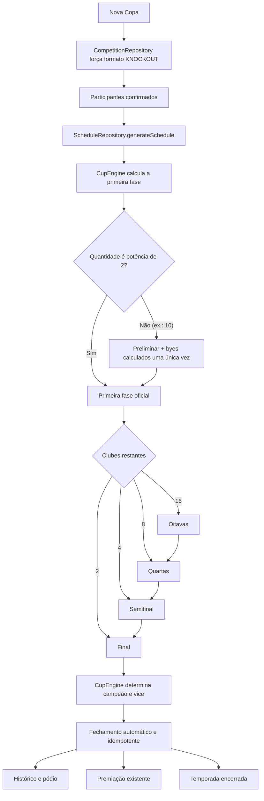

# RC-01A — Fluxo oficial da Copa

## Invariantes

- A fase é identificada por `stageLabel` canônico, não pela última partida global finalizada.
- Uma rodada existente é reutilizada; o número `(seasonId, number)` nunca é recriado.
- Uma partida existente é reutilizada por fase, posição no chaveamento e perna.
- Os byes pertencem apenas à primeira fase e nunca recolocam eliminados no torneio.
- Em ida e volta, o vencedor é calculado pelo agregado; o desempate registrado na volta é respeitado.
- A Final encerra o avanço: nenhuma fase posterior é criada.
- A Copa funciona integralmente com Room, sem sessão Firebase.

