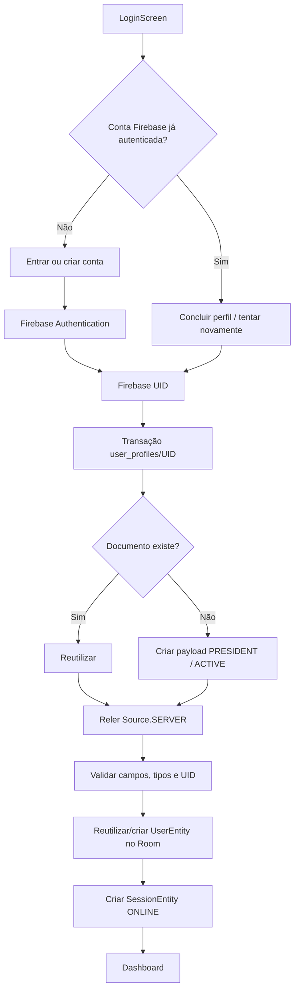

# HOTFIX RC-01B2 — BOOTSTRAP DEFINITIVO DO PERFIL ONLINE

Data: 05/08/2026  
Base: Legacy Master Liga oficial consolidada  
Versão gerada: `1.0.0-rc01b2` (`versionCode 42`)

## 1. Resultado executivo

O fluxo Auth → perfil → Room foi corrigido para ser idempotente, verificável e recuperável. O aplicativo agora:

1. autentica ou cria a conta no Firebase Authentication;
2. usa exatamente o Firebase UID como `documentId` em `user_profiles/{uid}`;
3. executa uma transação de leitura/criação;
4. relê o documento diretamente do servidor;
5. valida nomes, tipos, identidade, papel e estado;
6. cria/reutiliza o usuário correspondente no Room;
7. cria a sessão local;
8. somente então libera o Dashboard e a sincronização autenticada.

O Login não descarta mais a autenticação quando o perfil ainda não pôde ser concluído. Nesse estado, a tela oferece `TENTAR NOVAMENTE` e `SAIR DESTA CONTA`. Após logout, `CRIAR NOVA CONTA ONLINE` volta a aparecer.

Existe, porém, um bloqueio remoto confirmado: **o banco Firestore `(default)` ainda não existe no projeto `legacy-master-liga`**. Enquanto ele não for criado no Console Firebase/Google Cloud, nenhum cliente conseguirá criar `user_profiles/{uid}` e o Dashboard online continuará corretamente bloqueado.

## 2. Fluxograma auditado e corrigido



## 3. Causa raiz confirmada

### 3.1 Evidência do APK físico

O APK que apresentava o erro no Nox foi extraído e comparado com o RC-01B entregue anteriormente.

- SHA-256 instalado antes do hotfix: `CCB174C846D247C1E5877C119106EAB9DB2AB9D45FEDA3A67EED50FC76DDD25D`;
- SHA-256 do RC-01B anterior: igual;
- conclusão: o teste físico realmente utilizava o RC-01B, e não uma cópia antiga.

### 3.2 Resposta remota original

Um teste remoto controlado criou uma conta Auth temporária, consultou o Firestore sem gravar documento e apagou a conta imediatamente. A resposta foi:

```text
HTTP 404
status=NOT_FOUND
The database (default) does not exist for project legacy-master-liga
```

O mesmo erro foi reproduzido depois pelo APK RC-01B2 no Nox:

```text
category=FIRESTORE_DATABASE_MISSING
stage=transaction.read-or-create
path=user_profiles/{firebaseUid}
firestoreCode=NOT_FOUND
The database (default) does not exist for project legacy-master-liga
```

### 3.3 Ponto exato da exceção

- classe original: `com.google.firebase.firestore.FirebaseFirestoreException`;
- código original: `NOT_FOUND`;
- classe do aplicativo que preserva o contexto: `OnlineProfileBootstrapException`;
- arquivo: `FirestoreCloudAuthRepository.kt`;
- função: `getOrCreateProfile`;
- etapa: `transaction.read-or-create`;
- chamada que registra o contexto: linha 102 na fonte atual;
- criação da exceção contextual: `throwBootstrap`, linha 168 no APK/stack trace físico;
- caminho: `user_profiles/{Firebase UID}`.

Portanto, a causa não era senha, `user_profile` simplesmente ausente nem `PERMISSION_DENIED`. O recurso ausente é o próprio banco Firestore `(default)`.

## 4. Comparação exata: payload versus regras

O aplicativo deixou de depender da serialização implícita do POJO. `CloudUserProfileDocument.payload()` produz explicitamente:

| Campo | Tipo enviado | Valor/regra de criação |
|---|---:|---|
| `firebaseUid` | String | igual ao Firebase UID e ao `documentId` |
| `localUserId` | Long/int | ID local ou `0` |
| `username` | String | não vazio, máximo de 64 caracteres |
| `displayName` | String | não vazio, máximo de 120 caracteres |
| `role` | String | sempre `PRESIDENT` no bootstrap cliente |
| `status` | String | sempre `ACTIVE` no bootstrap cliente |
| `leagueId` | Long/int ou null | opcional |
| `clubId` | Long/int ou null | opcional |
| `createdAt` | Long/int | horário de criação |
| `updatedAt` | Long/int | horário de atualização |

As regras RC-01B2:

- permitem leitura somente de `user_profiles/{request.auth.uid}`;
- permitem criação somente no próprio UID;
- exigem exatamente os campos e tipos acima;
- exigem `PRESIDENT` e `ACTIVE` na criação cliente;
- impedem autopromoção para `ADMINISTRATOR`;
- preservam `firebaseUid`, `role`, `status` e `createdAt` em updates cliente;
- continuam proibindo exclusão pelo cliente;
- preservam perfis administrativos previamente atribuídos por mecanismo confiável, pois o cliente não pode alterar o papel existente.

O emulador local do Firestore iniciou em modo Standard Edition carregando as regras RC-01B2 sem erro de sintaxe. O comando auxiliar usado para encerrar o emulador falhou por uma configuração inválida de `PATH` do ambiente Windows; isso ocorreu depois de o Firestore Emulator iniciar e não representa erro das regras.

## 5. Correções implementadas

### Bootstrap e validação

- criação direta de conta online no fluxo principal;
- transação atômica e idempotente em `user_profiles/{uid}`;
- nenhuma utilização de e-mail como ID de documento;
- releitura obrigatória com `Source.SERVER` após a transação;
- codec explícito para payload e leitura;
- detecção separada de perfil inexistente, incompleto, inválido e UID divergente;
- logging com etapa, caminho, código Firestore e mensagem original.

### Sessão e recuperação

- conta Auth permanece autenticada quando o bootstrap falha por Firestore;
- nenhuma sessão Room é criada antes de o perfil ser válido;
- nenhuma sincronização esportiva é iniciada antes do perfil e da sessão;
- retry utiliza o `currentUser.uid`, sem novo login nem novo perfil;
- logout limpa Room e Firebase Auth;
- Dashboard continua protegido pela existência da sessão Room.

### Tela

Sem redesign. A identidade Retro Championship Edition foi preservada. Foram acrescentados apenas os controles necessários ao estado online:

- desconectado: `CONECTAR` e `CRIAR NOVA CONTA ONLINE`;
- Auth presente/perfil pendente: `TENTAR NOVAMENTE` e `SAIR DESTA CONTA`;
- logout: retorno ao estado desconectado, com reaparecimento do cadastro.

## 6. Arquivos alterados

### Produção/configuração

- `app/build.gradle.kts`
- `firestore.rules`
- `app/src/main/java/com/example/legacymasterliga/core/navigation/LegacyNavGraph.kt`
- `app/src/main/java/com/example/legacymasterliga/core/network/FirebaseErrorMapper.kt`
- `app/src/main/java/com/example/legacymasterliga/feature/login/presentation/LoginScreen.kt`
- `app/src/main/java/com/example/legacymasterliga/feature/login/presentation/LoginUiState.kt`
- `app/src/main/java/com/example/legacymasterliga/feature/login/presentation/LoginViewModel.kt`
- `app/src/main/java/com/example/legacymasterliga/feature/online/data/CloudUserProfileDocument.kt` — novo
- `app/src/main/java/com/example/legacymasterliga/feature/online/data/CloudUserProfileFactory.kt`
- `app/src/main/java/com/example/legacymasterliga/feature/online/data/FirestoreCloudAuthRepository.kt`
- `app/src/main/java/com/example/legacymasterliga/feature/online/domain/CloudAuthRepository.kt`
- `app/src/main/java/com/example/legacymasterliga/feature/online/domain/OnlineLoginService.kt`

### Testes

- `FirebaseErrorMapperTest.kt`
- `LoginUiStateTest.kt` — novo
- `CloudUserProfileDocumentTest.kt` — novo
- `CloudUserProfileFactoryTest.kt`
- `OnlineLoginServiceTest.kt`

Não foram alterados Liga, Copa, Dashboard, Mercado, Financeiro, Room schema/migrations, ONLINE-006 ou demais módulos de negócio.

## 7. Testes e build

### Gradle

| Validação | Resultado |
|---|---|
| `clean` + compilação limpa | sucesso |
| testes específicos RC-01B2 | 27 executados, 27 aprovados |
| `:app:testDebugUnitTest` | 88 executados, 87 aprovados, 1 falha preexistente |
| `:app:assembleDebug` | `BUILD SUCCESSFUL` |

A única falha da suíte completa continua sendo:

```text
BackupRestoreIntegrationTest > backup header uses official version and restore reopens clean data
```

Ela pertence ao backup/restore, já existia antes da RC-01B2 e não foi alterada por proteção de escopo.

### Casos cobertos automaticamente

- credenciais válidas;
- senha errada sem acesso ao Firestore;
- conta Auth sem perfil;
- criação/reutilização idempotente;
- primeiro bootstrap;
- segundo login usando a mesma identidade;
- retry com `currentUser` sem novo Auth;
- perfil existente;
- perfil incompleto;
- papel/tipo inválido;
- perfil inativo;
- sessão Room;
- restauração de sessão Auth;
- logout;
- reaparecimento do cadastro após logout;
- `PERMISSION_DENIED` separado;
- banco Firestore ausente separado;
- payload e nomes/tipos dos dez campos;
- cliente local ADMIN nunca cria perfil cloud ADMIN.

### Teste físico no Nox

- APK final instalado como `versionCode 42`, `versionName 1.0.0-rc01b2`;
- SHA-256 do APK extraído do Nox igual ao APK entregue;
- estado desconectado validado;
- criação de conta Auth temporária validada;
- erro remoto original capturado;
- estado de recuperação validado;
- logout validado;
- botão de cadastro reapareceu;
- conta temporária removida do Firebase Authentication;
- nenhum documento temporário foi criado, pois o banco Firestore não existe.

O celular físico não estava conectado ao ambiente. A validação nele deve usar exatamente o APK e o SHA-256 informados abaixo; não foi declarado teste físico de celular sem evidência.

## 8. APK RC-01B2

- caminho: `outputs/LegacyMasterLiga-RC01B2-debug.apk`;
- tamanho: `26.235.807 bytes`;
- SHA-256: `FC407335EFE410FB2C8C946237AE78EC247BA18B0138B9F3EECE0CF23ED485E8`.

## 9. Ação remota obrigatória antes do teste de sucesso

1. abrir o projeto Firebase `legacy-master-liga`;
2. abrir **Firestore Database**;
3. criar o banco **`(default)`** em modo de produção;
4. escolher conscientemente a região — essa escolha é permanente;
5. publicar novamente o `firestore.rules` da RC-01B2:

```text
firebase deploy --only firestore:rules --project legacy-master-liga
```

Não usar modo aberto e não usar `allow read, write: if true`.

## 10. Roteiro físico — Nox e celular com o mesmo APK

1. copiar `LegacyMasterLiga-RC01B2-debug.apk` para os dois dispositivos;
2. conferir o SHA-256 antes da instalação;
3. instalar como atualização, sem limpar dados;
4. abrir `ONLINE`;
5. para uma conta Auth já existente sem perfil, tocar `CONECTAR` ou `TENTAR NOVAMENTE`;
6. confirmar a criação de um único documento `user_profiles/{uid}`;
7. confirmar entrada no Dashboard;
8. fechar e reabrir o aplicativo: a sessão deve ser restaurada;
9. sair: o cadastro deve reaparecer;
10. repetir no segundo dispositivo com a mesma conta e o mesmo APK;
11. confirmar que o mesmo `user_profiles/{uid}` foi reutilizado, sem duplicação.

Também validar separadamente: senha errada, conta inexistente, perfil incompleto e regras negando acesso a UID alheio.

## 11. Estado final

O código RC-01B2 e o APK estão prontos. O diagnóstico está confirmado e não há mais mensagem genérica para esse caso. O sucesso até o Dashboard não pode ser declarado enquanto o Firestore `(default)` não for criado e as regras RC-01B2 não forem publicadas. ONLINE-006 e UX-002B não foram iniciadas.
