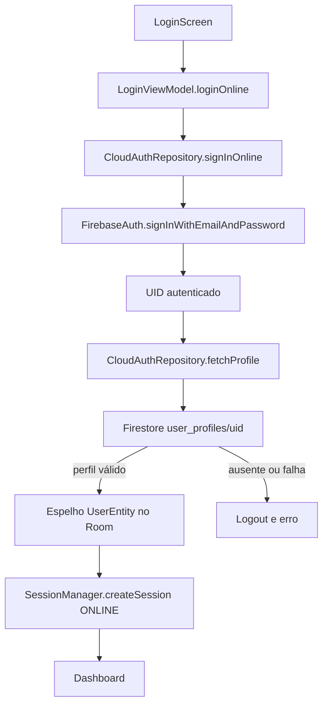
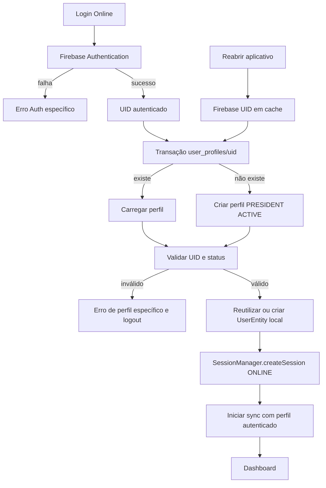

# RC-01B — Estabilização Definitiva do Login Online

Data: 05/08/2026  
Base: RC-01A3 aprovada  
Escopo: Firebase Authentication, `user_profiles/{uid}` e sessão online local

## 1. Resultado executivo

O fluxo pós-autenticação foi consolidado em uma única sequência:

1. autenticar E-mail/Senha no Firebase Auth;
2. obter o UID autenticado;
3. ler ou criar atomicamente `user_profiles/{uid}`;
4. validar identidade e status do perfil;
5. criar ou reutilizar o espelho local no Room;
6. criar a sessão `ONLINE`;
7. iniciar a sincronização somente depois do perfil ativo;
8. restaurar a mesma sequência ao reabrir o aplicativo quando o Firebase mantiver o usuário autenticado.

O Login visual, Dashboard, navegação, Liga, Copa, Mercado e Financeiro não foram alterados.

## 2. Auditoria anterior à correção

Nenhum código foi alterado antes do mapeamento completo.

### Fluxo encontrado



### Ponto exato da falha anterior

- classe: `FirestoreCloudAuthRepository`;
- arquivo: `feature/online/data/FirestoreCloudAuthRepository.kt`;
- função: `fetchProfile(uid)`;
- linha anterior: 60;
- operação: `user_profiles/{uid}.get(Source.SERVER).await()`;
- exceção observada no relatório de regressão anterior: `FirebaseFirestoreException` com código `UNAVAILABLE`;
- segunda condição: documento inexistente retornava `null`, e `LoginViewModel.loginOnline()` criava `OnlineProfileNotFoundException` na linha anterior 76;
- consequência: logout antes da criação da sessão Room.

A mensagem **“Servidor temporariamente indisponível”** pertencia ao mapeador antigo. A busca confirmou zero ocorrências dessa mensagem no código e no APK RC-01A3 consolidado.

## 3. Causa raiz

A falha não estava na validação da senha. O Firebase Auth completava e entregava um UID, mas Auth e Firestore eram tratados como duas operações independentes sem recuperação:

- `createUserWithEmailAndPassword()` criava primeiro a conta no Auth;
- somente depois o aplicativo tentava gravar `user_profiles/{uid}`;
- uma falha nessa gravação deixava uma conta Firebase válida sem perfil;
- os logins seguintes apenas liam o perfil;
- perfil ausente era tratado como erro fatal, nunca criado automaticamente;
- o fluxo alternativo de `OnlineAuthViewModel` vinculava o UID local sem garantir a existência do perfil;
- a restauração ao reabrir o aplicativo não recarregava o perfil nem reativava a sessão online.

Essa combinação explica o sintoma: senha errada era rejeitada pelo Auth; senha correta passava pelo Auth e falhava imediatamente depois.

## 4. Correção aplicada

### Provisionamento atômico e idempotente

`FirestoreCloudAuthRepository.getOrCreateProfile()` agora executa uma transação Firestore:

- se `user_profiles/{uid}` existe, reutiliza o documento;
- se não existe, cria uma única vez;
- valida que o UID do documento corresponde ao usuário autenticado;
- nunca duplica documentos, pois o UID é o identificador global;
- uma conta órfã criada por uma tentativa antiga é reparada no próximo login válido.

Quando não existe usuário local vinculado, o perfil novo recebe:

- cargo `PRESIDENT`;
- status `ACTIVE`;
- username estável derivado do e-mail e do UID;
- nome exibido derivado do Firebase ou do e-mail.

### Sessão local

`OnlineLoginService` passou a controlar a ordem Auth → perfil → Room. `RoomOnlineLocalSessionGateway`:

- reutiliza usuário local pelo Firebase UID;
- vincula com segurança o participante original quando a conta nasceu na mesma instalação;
- evita capturar outro usuário apenas por coincidência de username;
- cria um espelho local em instalação limpa;
- reutiliza o mesmo espelho no segundo login;
- cria a sessão com origem `ONLINE`.

### Persistência

`LegacyMasterLigaApp` tenta restaurar a sessão usando o UID mantido pelo Firebase Auth. A sincronização esportiva só é iniciada depois que o perfil existe, está ativo e a sessão Room foi aberta.

Se a restauração falhar por indisponibilidade transitória do Firestore, a sessão local existente não é apagada.

### Erros diferenciados

O mapeamento distingue:

- credencial inválida;
- Auth indisponível;
- falta de internet;
- `PERMISSION_DENIED`;
- perfil ausente;
- perfil inativo;
- perfil inválido/corrompido;
- identidade Firebase divergente;
- projeto Firebase incorreto;
- timeout;
- Firestore indisponível;
- erro inesperado.

## 5. Fluxo corrigido



## 6. Configuração Firebase auditada

Confirmado localmente:

- `project_id`: `legacy-master-liga`;
- package: `com.example.legacymasterliga`;
- `google-services.json` único e compatível com o `applicationId` debug;
- Firebase Auth e Firestore inicializados por Hilt;
- regras locais permitem ao usuário autenticado ler e criar apenas o próprio `user_profiles/{uid}`;
- `firebase.json` e `.firebaserc` foram adicionados apontando explicitamente para o projeto e para `firestore.rules`;
- Firebase CLI 15.25.1 preparado.

Não foi possível confirmar no Console se as regras locais estão publicadas nem publicá-las, pois o Firebase CLI e o navegador não possuem sessão Google autenticada. O CLI retornou: `Failed to authenticate, have you run firebase login?`.

Com uma sessão autorizada, a publicação preparada é:

```text
firebase deploy --only firestore:rules --project legacy-master-liga
```

O provedor E-mail/Senha responde no teste físico relatado, pois diferencia senha errada de senha correta. Essa inferência não substitui a confirmação visual no Console.

## 7. Arquivos alterados

Produção:

- `.firebaserc`;
- `firebase.json`;
- `app/src/main/java/com/example/legacymasterliga/LegacyMasterLigaApp.kt`;
- `app/src/main/java/com/example/legacymasterliga/core/di/RepositoryModule.kt`;
- `app/src/main/java/com/example/legacymasterliga/core/network/FirebaseErrorMapper.kt`;
- `app/src/main/java/com/example/legacymasterliga/feature/login/presentation/LoginViewModel.kt`;
- `app/src/main/java/com/example/legacymasterliga/feature/online/domain/CloudAuthRepository.kt`;
- `app/src/main/java/com/example/legacymasterliga/feature/online/domain/OnlineLoginService.kt`;
- `app/src/main/java/com/example/legacymasterliga/feature/online/data/CloudUserProfileFactory.kt`;
- `app/src/main/java/com/example/legacymasterliga/feature/online/data/FirestoreCloudAuthRepository.kt`;
- `app/src/main/java/com/example/legacymasterliga/feature/online/data/RoomOnlineLocalSessionGateway.kt`;
- `app/src/main/java/com/example/legacymasterliga/feature/online/presentation/OnlineAuthViewModel.kt`.

Testes:

- `app/src/test/java/com/example/legacymasterliga/feature/online/domain/OnlineLoginServiceTest.kt`;
- `app/src/test/java/com/example/legacymasterliga/feature/online/data/CloudUserProfileFactoryTest.kt`;
- `app/src/test/java/com/example/legacymasterliga/feature/online/data/RoomOnlineLocalSessionGatewayTest.kt`;
- `app/src/test/java/com/example/legacymasterliga/core/network/FirebaseErrorMapperTest.kt`.

## 8. Proteção dos módulos congelados

Comparação por SHA-256 com a base oficial RC-01A3 confirmou conteúdo idêntico para:

- `LoginScreen.kt`;
- `DashboardScreen.kt`;
- `LegacyNavGraph.kt`;
- `CupComingSoonScreen.kt`;
- `MarketScreen.kt`;
- `FinanceScreen.kt`;
- `Theme.kt`;
- `Color.kt`.

Não houve alteração visual, de navegação, Liga, Copa, Mercado ou Financeiro.

## 9. Testes da RC-01B

Foram adicionados 19 testes:

- `OnlineLoginServiceTest`: 8/8;
- `CloudUserProfileFactoryTest`: 3/3;
- `RoomOnlineLocalSessionGatewayTest`: 5/5;
- `FirebaseErrorMapperTest`: 3/3.

Cenários cobertos:

- autenticação válida;
- senha errada;
- primeiro login;
- segundo login;
- conta com perfil existente;
- conta órfã/perfil inexistente;
- criação automática do perfil;
- perfil inativo;
- falha Firestore preservada;
- sessão criada somente após perfil válido;
- reutilização do usuário local;
- colisão de username sem sequestro de conta;
- restauração ao reabrir sem senha;
- ausência de usuário Firebase em cache;
- logout Room + Firebase;
- mensagens distintas para `PERMISSION_DENIED` e `UNAVAILABLE`.

## 10. Validação Gradle

### `clean`

- resultado: `BUILD SUCCESSFUL`;
- duração: 27 s.

### `:app:testDebugUnitTest`

- total: 75;
- aprovados: 74;
- falhos: 1;
- testes novos RC-01B: 19/19 aprovados.

Única falha global, preexistente e fora do escopo:

- `BackupRestoreIntegrationTest.backup header uses official version and restore reopens clean data`;
- a asserção de reabertura continua falhando ao procurar `Liga preservada`;
- nenhum arquivo de banco, backup ou restore foi alterado na RC-01B.

### `:app:assembleDebug`

- resultado: `BUILD SUCCESSFUL`;
- duração: 1 min 28 s;
- APK gerado com sucesso;
- warning não bloqueante: `libandroidx.graphics.path.so` empacotada sem strip.

Os comandos foram executados pela classe oficial do Gradle Wrapper do projeto porque a execução direta dos arquivos `.bat` é bloqueada pelo ambiente.

## 11. Artefatos

Backup anterior à RC-01B:

`outputs/LegacyMasterLiga-pre-RC01B-20260805.zip`

- tamanho: 720.122 bytes;
- SHA-256: `1DEA34D4D2671393FD24F16303615423E106C9190DACAB5062276CAD74FCB4E5`.

APK RC-01B:

`outputs/LegacyMasterLiga-RC01B-debug.apk`

- tamanho: 26.219.427 bytes;
- SHA-256: `CCB174C846D247C1E5877C119106EAB9DB2AB9D45FEDA3A67EED50FC76DDD25D`.

Publicação na base oficial do Android Studio:

- destino: `C:\Users\luizh\Downloads\Telegram Desktop\LegacyMasterLiga`;
- arquivos comparados após a cópia: 452;
- arquivos ausentes: 0;
- arquivos divergentes por SHA-256: 0;
- caches, builds, APKs, ZIPs e `local.properties` não foram copiados.

## 12. Validação física pendente

Os testes automatizados validam todos os estados pedidos sem alterar o Firebase de produção. Ainda faltam, em ambiente real autenticado:

1. publicar ou confirmar as regras Firestore;
2. instalar o APK RC-01B;
3. entrar com uma conta válida;
4. confirmar a criação/reutilização de `user_profiles/{uid}`;
5. fechar e reabrir o aplicativo;
6. confirmar entrada automática;
7. executar logout e novo login.

A RC-01B não inicia ONLINE-006 nem UX-002B.
